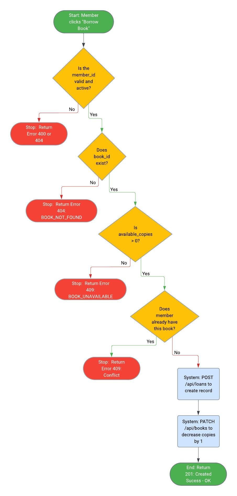
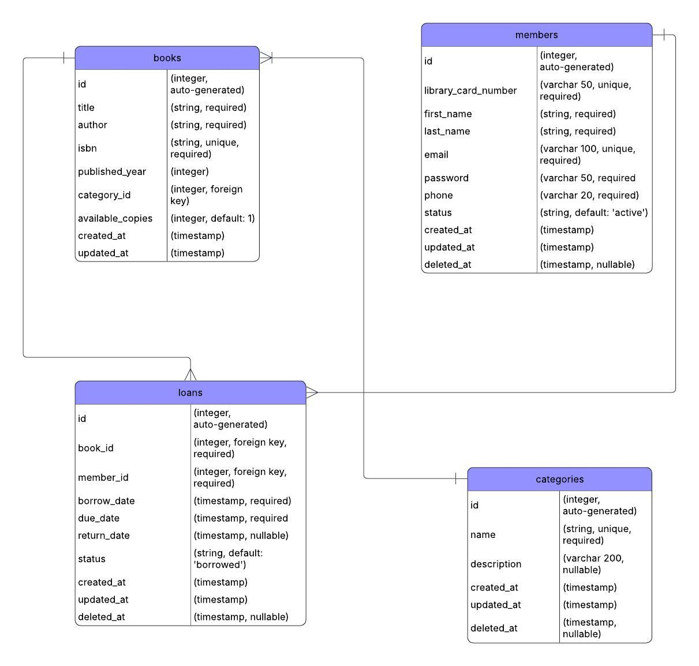

# Library Management System API Design

## 1. Overview
This Library Management System (LMS) API is a RESTful web service designed to handle core library operations. It provides endpoints to manage book catalogs, process member registrations, track borrowing systems (loans) and organize book classifications (categories).

## 2. Base URL
**Production:** `https://api.library.com/v1`
**Development:** `http://localhost:3000/api`

## 3. Resources and Properties

Resource: books
Properties:

- id (integer, auto-generated)
- title (string, required)
- author (string, required)
- isbn (string, unique, required)
- published_year (integer)
- category_id (integer, foreign key)
- available_copies (integer, default: 1)
- created_at (timestamp)
- updated_at (timestamp)

Resource: members
Properties:

- id (integer, auto-generated)
- library_card_number (varchar 50, unique, required)
- first_name (string, required)
- last_name (string, required)
- email (varchar 100, unique, required)
- password (varchar 50, required)
- phone (varchar 20, required)
- status (string, default: ‘active’)
- created_at (timestamp)
- updated_at (timestamp)
- deleted_at (timestamp, nullable)

Resource: loans
Properties:

- id (integer, auto-generated)
- book_id (integer, foreign key, required)
- member_id (integer, foreign key, required)
- borrow_date (timestamp, required)
- due_date (timestamp, required)
- return_date (timestamp, nullable) 
- status (string, default: ‘borrowed’)
- created_at (timestamp)
- updated_at (timestamp)
- deleted_at (timestamp, nullable)

Resource: categories
Properties:

- id (integer, auto-generated)
- name (string, unique, required)
- description (varchar 50, nullable)
- created_at (timestamp)
- updated_at (timestamp)
- deleted_at (timestamp, nullable)

## 4. Endpoints
**HTTP METHOD + URL & Description**

Resource: books

GET /api/books → Get all books
GET /api/books/:id → Get 1 book by ID
POST /api/books → Create new book
PUT /api/books/:id → Update (replace) book
PATCH /api/books/:id → Partially update book
DELETE /api/books/:id → Delete book

Resource: members

GET /api/members → Get all members
GET /api/members/:id → Get 1 member by ID
POST /api/members → Create a new member
PUT /api/members/:id → Update (replace) member details
PATCH /api/members/:id → Partially update member
DELETE /api/members/:id → Delete member

Resource: loans

GET /api/loans → Get all loans
GET /api/loans/:id → Get 1 loan by ID
POST /api/loans → Create a new loan (When a member borrows a book)
PUT /api/loans/:id → Update (replace) loan details
PATCH /api/loans/:id → Partially update loan (Used when book is returned – PATCH return_date and status)
DELETE /api/loans/:id → Delete loan

Resource: categories

GET /api/categories → Get all categories
GET /api/categories/:id → Get 1 category by ID
POST /api/categories → Create a new category
PUT /api/categories/:id → Update (replace) category details
PATCH /api/categories/:id → Partially update category
DELETE /api/categories/:id → Delete category

**Nested Resources and Relationships**

Relationship: books has many loans
GET /api/books/:id/loans → Get the checkout history for a specific book

Relationship: members has many loans
GET /api/members/:id/loans → Get entire loan history for 1 specific member
POST /api/members/:id/loans → Create a new loan for a specific member

Relationship: categories has many books
GET /api/categories/:id/books → Get list of all books under specific category

**Request Body Examples**

Endpoint: POST /api/books

Request Body: 
{
“title”: “Harry Potter and the Cursed Child”,
“author”: “J.K. Rowling”,
“isbn”: “978-1338099133”,
“published_year”: 2016, 
“category_id”: 2,
“available_copies”: 5
}

1. 
Endpoint: POST /api/members (create a new member)

Request Body 
{
“library_card_number”: “785425”,
“first_name”: “Ricardo”,
“last_name”: “Villarin”, 
“email”: “ricardo99villarin@gmail.com”, 
“password”: “*******”,
“phone”: “09264470866”,
“status”: “active”
}

2. 
Endpoint: POST /api/loans (borrow a book)

Request Body 
{
“book_id”: 6,
“member_id”: 10,
“borrow_date”: “2026-09-26T13:31:01Z”,
“due_date”: “2026-12-05”,
“status”: “borrowed”
}

3. 
Endpoint: PATCH /api/books/:id (update book availability)

Request Body 
{
“available_copies”: “4”
}

**Response Body Examples**

Endpoint: GET /api/books/3

Success Response (200 OK): 
{
“id”: 3, 
“title”: “A Gentle Reminder”, 
“author”: “Bianca Sparacino”,
“isbn”: “978-1949759297”, 
“published_year”: 2020,
“category_id”: 3,
“available_copies”: 4, 
“created_at”: “2025-01-28T11:00:00Z”,
“updated_at”: “2025-01-28T11:01:00Z”
}

Error Response (404 Not Found):
{
“error”: {
      “code”: “BOOK_NOT_FOUND”,
      “message”: “Book with ID 3 does not exist”
   }
}

1. (/api/members/:id)
Endpoint: GET /api/members/10

Success Response (200 OK):
{
“id”: 10, 
“library_card_number”: “785425”,
“first_name”: “Ricardo”, 
“last_name”: “Villarin”, 
“email”: “ricardo99villarin@gmail.com”, 
“phone”: “09264470866”,
“status”: “active”,
“created_at”: “2025-09-05T09:30:00Z”,
“updated_at”: “2025-09-05T11:30:00Z”
}

Error Response (404 Not Found): 
{
“error”: {
      “code”: “MEMBER_NOT_FOUND”,
      “message”: “Member with ID 10 does not exist”
   }
}

2. 
Endpoint: POST /api/loans

Success Response (201 Created):
{
“id”: 5,
“book_id”: 7,
“member_id”: 9, 
“borrow_date”: “2026-07-18T13:31:01Z”,
“due_date”: “2026-10-01”,
“status”: “borrowed”,
“created_at”: “2026-07-18T16:14:10Z”,
“updated_at”: “2026-07-18T16:14:36Z”
}

Error Response (400 Bad Request): 
{
“error”: {
      “code”: “BOOK_UNAVAILABLE”,
      “message”: “Book with ID 7 is currently out of stock”
   }
}

3. (/api/books/:id)
Endpoint: DELETE /api/books/7

Success Response (200 OK):
{
“message”: “Book deleted successfully”, 
“id”: 7, 
“title”: “A Gentle Reminder”, 
“author”: “Bianca Sparacino”,
“isbn”: “978-1949759297”, 
“published_year”: 2020,
“category_id”: 3,
“available_copies”: 5, 
“deleted_at”: “2026-10-12T13:06:02Z”
}

## 5. Authentication
The API is secured using **JSON Web Tokens (JWT)**. 
**Login Endpoint:** Users provide their email and password via `POST /api/auth/login`.
**Token Usage:** Upon successful login, the server returns a JWT. The client must include this token in the header of all subsequent requests to protected endpoints.
**Role-Based Access Control (RBAC):** The token payload will include the user's role (`admin/librarian` or `member`) to restrict access.

## 6. Status Codes Mapping & Error Handling

Endpoint: POST /api/books

- Success: N/A (use 201 Created for this)
- Created: 201 (Book created successfully)
- Bad Request: 400 (Missing required fields: title, author, isbn)
- Not Found: 404 (Category ID does not exist)
- Conflict: 409 (Book with this isbn already exists)
- Server Error: 500 (Database connection failed)

1. 
Endpoint: GET /api/books/:id

- Success: 200 OK
- Created: N/A (use 200 Success OK for this)
- Bad Request: 400 (ID format is invalid, like /api/books/b instead of a number)
- Not Found: 404 (Book ID does not exist)
- Conflict: N/A (was only using GET)
- Server Error: 500 (Database connection failed)

2. 
Endpoint: POST /api/members

- Success: N/A (use 201 Created for this)
- Created: 201 (Member created successfully)
- Bad Request: 400 (Missing required fields: library_card_number, first_name, last_name, email, password, phone)
- Not Found: N/A (Creating a new member)
- Conflict: 409 (Member with this email or library_card already exists)
- Server Error: 500 (Database connection failed)

3. 
Endpoint: POST /api/loans (borrowing a book)

- Success: N/A (use 201 Created for this)
- Created: 201 (Loan created successfully)
- Bad Request: 400 (Missing required fields: book_id, member_id, borrow_date, due_date. Or Book is out of stock)
- Not Found: N/A (Creating a new loan)
- Conflict: 409 (Member has already borrowed this exact book and hasn’t returned it yet)
- Server Error: 500 (Database connection failed)

4. /api/books/:id
Endpoint: DELETE /api/books/7

- Success: 200 (Book deleted successfully)
- Created: N/A (use 200 Success for this)
- Bad Request: 400 (Invalid format)
- Not Found: 404 (Book with ID 7 does not exist)
- Conflict: 409 (Cannot delete this book as it’s currently checked out by member)
- Server Error: 500 (Database connection failed)

## 7. Special Scenarios

1. 
Scenario: Borrowing a book with 0 available copies
Status Code: 409
Error Code: “BOOK_NOT_AVAILABLE”
Error Message: “This book has no available copies for borrowing”

2. 
Scenario: Returning an existing loan
Status Code: 409
Error Code: “LOAN_ALREADY_RETURNED”
Error Message: “This loan has already been returned”

3. 
Scenario: Deleting a book with active loans
Status Code: 409
Error Code: “BOOK_STILL_ACTIVE”
Error Message: “This book is currently being borrowed and hasn’t returned yet”

4. 
Scenario: Creating a member with duplicate email
Status Code: 409
Error Code: “MEMBER_EMAIL_ALREADY_EXISTS”
Error Message: “This email has already been used”

**Advanced Features: Query Parameters for Filtering & Sorting**

1. 
GET /api/books (search, filter by category, sort, paginate)

- ?search=Harry  Search books with “Harry” in the title or author
- ?sort=available_copies  Sort by available copies
- ?order= asc  Lowest first
- ?page=1&limit= 7  First page, 7 items per page 

FULL URL: 
GET /api/books?search=Harry&sort=available_copies&order=asc&page=1&limit=7

2. 
GET /api/loans (filter by status: active/returned/overdue, filter by member)

- ?status=overdue&member_id=10  Filter by overdue loans for member_id 10

FULL URL: 
GET /api/loans?status=overdue&member_id=10

## 8. Future Enhancements (API Versioning)
Current Version: v1
New Version: v2

Breaking Change: Remove “first_name” and “last_name” fields from members, replaced with “full_name”
Migration Strategy: Support both/v1/books and /v2/ books for 3 months
Deprecation Timeline: Announce v1 deprecation on 2026-09-11, remove on 2026-12-11.

**Flowchart and ERD**

